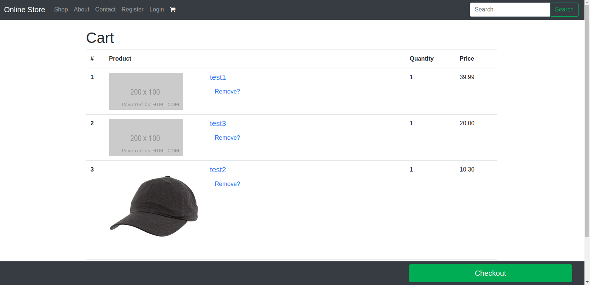

# Django_ecommerce_store1
 

This is the skeleton of an ecommerce store I built while following the <a href='https://www.codingforentrepreneurs.com/courses/ecommerce'>Coding for entrepreneurs: ecommerce</a> course. It's an excellent course by the way. I've taken many of the principles from each lesson and adapted them to my needs.

## Install
 

1. Clone this repository.
2. Run 'pip install django==2.1.1' in your terminal.
3. In the terminal, move to the folder containing the manage.py file.
4. Run 'python manage.py runserver'.
5. Open your web browser to the url specified in the terminal.

<h2>Store home page.</h2> 

 

<h2>Store products listed on home page.</h2> 

 

<h2>Store checkout page.</h2> 

 
